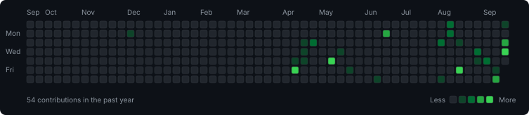

# hey, i'm lucid 👋

**Building things. Learning along the way.**

Python scripts, web experiments, and useful little tools. 
Founder of [Lucid Development](https://github.com/lucid-development-official) · Coding since 2024

[Projects](https://github.com/Lucidiscool?tab=repositories) &nbsp; / &nbsp; [Lucid Development](https://github.com/lucid-development-official) &nbsp; / &nbsp; [Website](https://lucid-development-official.github.io/Our-Website/)

---

## 💻 stuff i tinker with

  
  
  
  
  

Also exploring <strong>Go · C++ · Swift</strong>.

## 🌱 a little about me

I started programming in **2024** with a JavaScript Discord bot. Since then, I've been learning by building—turning ideas into scripts, websites, and personal projects.

I'm growing **Lucid Development**, trying new technologies, and getting a little better with every project.

## 🛠️ things i've built

<!-- PINNED-PROJECTS:START -->

| Project | What it's about | Built with |
| :--- | :--- | :--- |
| [Lucid-AI-Public](https://github.com/Lucidiscool/Lucid-AI-Public) | — | Python |
| [pi](https://github.com/Lucidiscool/pi) | Code project to help me learn more abt code and using github pages | JavaScript |
| [Monitor-Toggler](https://github.com/Lucidiscool/Monitor-Toggler) | — | C# |
| [Lucidiscool](https://github.com/Lucidiscool/Lucidiscool) | Config files for my GitHub profile. | JavaScript |

<!-- PINNED-PROJECTS:END -->

Synced from my pinned repositories every six hours.

## 📈 one square at a time

  

Contribution history · refreshes every six hours.

## 🤝 find me

**Discord:** `@datjubilee` &nbsp; · &nbsp; **GitHub:** [@Lucidiscool](https://github.com/Lucidiscool) &nbsp; · &nbsp; **Organization:** [Lucid Development](https://github.com/lucid-development-official)

---

Always learning. Always making something.

<!-- Pinned projects and assets/contributions.svg are generated by the Refresh profile workflow.
     Run it manually in Actions for an earlier refresh. No personal access token is required.
     GitHub may delay scheduled runs or disable schedules after 60 days of repository inactivity. -->
